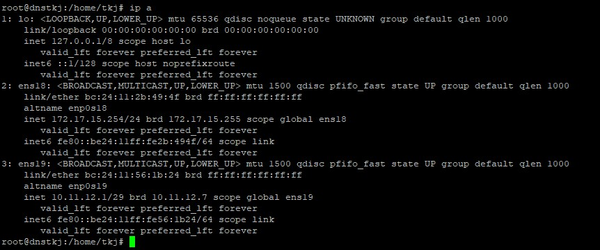

# Network Setting
Contoh konfigurasi dibawah ini, sebuah server mempunyai 2 interface jaringan yaitu ens18 dan ens19. Untuk mengkonfigurasinya, kita perlu mengedit file ```/etc/netplan/50-cloud-init.yaml```.

## Konfigurasi Jaringan
1. Buka dan edit file ```/etc/netplan/50-cloud-init.yaml``` dengan menggunakan editor vim.

   ```vim /etc/netplan/50-cloud-init.yaml```
   
2. Edit dan sesuaikan dengan kondisi jaringan yang ada

   ```
   network:
       ethernets:
           ens18:
               addresses:
               - 172.17.15.254/24
               nameservers:
                   addresses:
                   - 172.17.15.1
                   search: []
               routes:
               -   to: default
                   via: 172.17.15.1
           ens19:
               addresses:
               - 10.11.12.1/29
       version: 2
   ```
3. Simpan dan keluar dari mode konfigurasi dengan perintah

   ```:qw```
5. Terapkan konfigurasi jaringan dengan menggunakan perintah
  
   ```netplan apply```
8. Periksa jaringan yang telah dibuat tadi, dengan perintah ```ip a```

   
